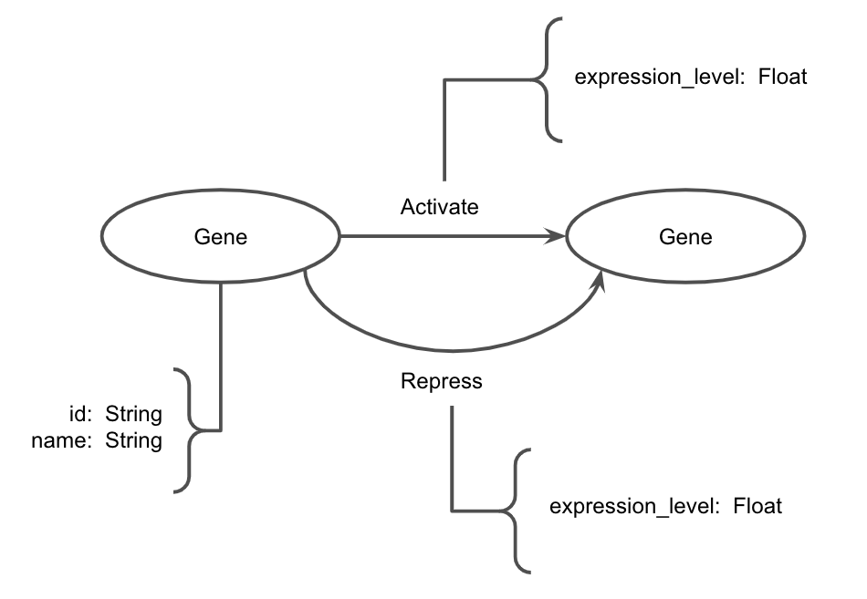
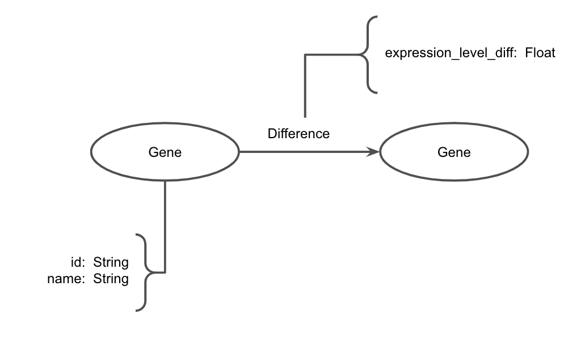

# Projeto `Expressão Gênica (EG) na Estimulação Elétrica Neuromuscular (EENM) em pacientes com Lesão Medular (LM)`
#### Project `Gene Expression in Neuromuscular Electrical Stimulation in Patients with Spinal Cord Injury`

# Descrição Resumida do Projeto

Este projeto visa estudar como a *Estimulação Elétrica Neuromuscular (EENM)* afeta a expressão gênica em pacientes com *Lesão Medular (LM)*, especialmente nos processos musculares de atrofia e hipertrofia. A EENM é uma técnica que pode melhorar a qualidade de vida ao reduzir a espasticidade e restaurar o movimento em pacientes com LM. A pesquisa se baseia em genes associados à atrofia (**atrogin-1/MAFbx** e **MuRF-1**) e à hipertrofia (**MyoD**, **Myf-5**, **miogenina** e **IGF-1**) muscular. 

# Fundamentação Teórica

1. ROSA, G. M. M. et al. Efeitos da eletroestimulação e do alongamento muscular sobre a adaptação do músculo desnervado – implicações para a fisioterapia. *Revista Brasileira de Fisioterapia*, v. 14, n. 4, p. 349-357, 2010. Disponível em: [https://www.scielo.br/j/rbfis/a/76d4DxDN7TffVJ9g9Kp4nND/?format=pdf&lang=pt](https://www.scielo.br/j/rbfis/a/76d4DxDN7TffVJ9g9Kp4nND/?format=pdf&lang=pt). Acesso em: 12 abr. 2024.

2. OLIVEIRA, L. S. et al. Efeitos da estimulação elétrica na adaptação do músculo esquelético desnervado: implicações sobre a expressão gênica. *Revista Brasileira de Ciências da Saúde*, v. 14, n. 2, p. 127-135, 2015. Disponível em: [https://repositorio.ufscar.br/bitstream/handle/ufscar/5105/2133.pdf?sequence=1&isAllowed=y](https://repositorio.ufscar.br/bitstream/handle/ufscar/5105/2133.pdf?sequence=1&isAllowed=y). Acesso em: 12 abr. 2024.

3. SILVA, R. F. et al. Efeitos do trauma contuso e do exercício exaustivo no em MuRF1 e MAFBX no músculo esquelético de ratos. *Revista Brasileira de Medicina do Esporte*, v. 22, n. 5, p. 386-392, 2016. Disponível em: [https://www.scielo.br/j/rbme/a/4GfksnJLPtCh68yvJRtJThH/?lang=pt](https://www.scielo.br/j/rbme/a/4GfksnJLPtCh68yvJRtJThH/?lang=pt). Acesso em: 12 abr. 2024.

4. FRANCO, A. R. et al. Abordagem multiprofissional em lesão medular. São Paulo: Instituto Federal de Santa Catarina, 2018. Disponível em: [https://www.ifsc.edu.br/documents/30701/523474/Lesao+Medular+WEB.pdf/39df2463-bd7b-5e88-7a8f-da0594784c9b](https://www.ifsc.edu.br/documents/30701/523474/Lesao+Medular+WEB.pdf/39df2463-bd7b-5e88-7a8f-da0594784c9b). Acesso em: 12 abr. 2024.

5. CARVALHO, P. S. A bioquímica da lesão muscular. *Revista de Educação Física*, v. 25, n. 3, p. 215-225, 2019. Disponível em: [https://www.institutosport.com.br/bioquimica-da-lesao](https://www.institutosport.com.br/bioquimica-da-lesao). Acesso em: 12 abr. 2024.

6. SOUZA, M. T. A influência do exercício físico na expressão do gene decorrente da desnervação muscular em ratos. Dissertação (Mestrado em Ciências da Saúde) - Universidade Federal de Minas Gerais, Belo Horizonte, 2019. Disponível em: [https://repositorio.ufmg.br/bitstream/1843/BUOS-B4KG63/1/dissertac_a_o__final_.pdf](https://repositorio.ufmg.br/bitstream/1843/BUOS-B4KG63/1/dissertac_a_o__final_.pdf). Acesso em: 12 abr. 2024.

7. SENE, M. O. Análise do efeito da natação sobre a expressão gênica dos fatores de crescimento muscular. Tese (Doutorado em Educação Física) - Universidade de São Paulo, São Paulo, 2003. Disponível em: [https://www.teses.usp.br/teses/disponiveis/82/82131/tde-01092003-110729/publico/TDE_MarcelaOliveiraSene.pdf](https://www.teses.usp.br/teses/disponiveis/82/82131/tde-01092003-110729/publico/TDE_MarcelaOliveiraSene.pdf). Acesso em: 12 abr. 2024.

# Perguntas de Pesquisa

> Perguntas de pesquisa que o projeto pretende responder ou hipóteses a serem avaliadas, enunciadas de maneira objetiva e verificável.

1. Como a lesão muscular interfere na expressão desses genes? 
2. A estimulação elétrica neuromuscular altera a expressão desses genes?

# Bases de Dados

Base de Dados | Resumo descritivo
----- | -----
[IGF-1](https://string-db.org/cgi/network?taskId=b8ePHc3wZqdF&sessionId=bZTnXk3aFveC) | Proteínas relacionadas ao IGF-1
[Atrogina-1](https://string-db.org/cgi/network?taskId=bAiwgZruIpcl&sessionId=bO2qss02GiDr) | Proteínas relacionadas a Antrogina-1

# Modelo Lógico

---

# Metodologia

**Pergunta de Pesquisa:** Como a lesão muscular interfere na expressão desses genes?

**Técnica:** Identificação de Hubs Genéticos

**Descrição:** Esta técnica visa identificar genes que desempenham papéis centrais na regulação da atrofia e hipertrofia muscular. 
Para isso, utilizaremos dados de expressão gênica de tecidos musculares de pacientes com lesão medular, antes e depois da aplicação da Estimulação Elétrica Neuromuscular (EENM), 
juntamente com um interactoma representando as interações entre os genes. Os nós do grafo representam os genes, enquanto as arestas representam as interações diretas entre eles, 
como regulação gênica ou interações proteína-proteína. Os hubs genéticos serão identificados como nós com o maior número de conexões diretas.

---

**Pergunta de Pesquisa:** A estimulação elétrica neuromuscular altera a expressão desses genes?

**Técnica:** Centralidade e Expressão Gênica

**Descrição:** Esta técnica busca investigar se existe uma correlação entre a centralidade dos genes na rede e sua expressão diferencial em pacientes com lesão medular, antes e depois da aplicação da EENM. Utilizaremos dados de expressão gênica e um interactoma representando as interações entre os genes. Além das conexões diretas entre os genes, este modelo atribuirá pesos às arestas com base na intensidade da interação ou na diferença na expressão gênica entre os estados antes e depois da aplicação da EENM. A centralidade dos nós será calculada considerando tanto o número quanto o peso das conexões.

# Ferramentas

### [Neo4j](https://neo4j.com/)

- **Armazenamento de Dados de Expressão Gênica**: Perfis de expressão gênica de tecidos musculares antes e depois da aplicação da EENM.
- **Armazenamento de Interactoma**: Conjunto de interações entre genes, obtido de bancos de dados experimentais ou preditivos.

### [Cytoscape](https://cytoscape.org/)
- **Identificação de Hubs Genéticos**: Nós mais conectados na rede.
- **Centralidade e Expressão Gênica**: Importância dos nós com base em medidas de centralidade e expressão gênica.

# Referências Bibliográficas

1. ROSA, G. M. M. et al. Efeitos da eletroestimulação e do alongamento muscular sobre a adaptação do músculo desnervado – implicações para a fisioterapia. *Revista Brasileira de Fisioterapia*, v. 14, n. 4, p. 349-357, 2010. Disponível em: [https://www.scielo.br/j/rbfis/a/76d4DxDN7TffVJ9g9Kp4nND/?format=pdf&lang=pt](https://www.scielo.br/j/rbfis/a/76d4DxDN7TffVJ9g9Kp4nND/?format=pdf&lang=pt). Acesso em: 12 abr. 2024.

2. OLIVEIRA, L. S. et al. Efeitos da estimulação elétrica na adaptação do músculo esquelético desnervado: implicações sobre a expressão gênica. *Revista Brasileira de Ciências da Saúde*, v. 14, n. 2, p. 127-135, 2015. Disponível em: [https://repositorio.ufscar.br/bitstream/handle/ufscar/5105/2133.pdf?sequence=1&isAllowed=y](https://repositorio.ufscar.br/bitstream/handle/ufscar/5105/2133.pdf?sequence=1&isAllowed=y). Acesso em: 12 abr. 2024.

3. SILVA, R. F. et al. Efeitos do trauma contuso e do exercício exaustivo no em MuRF1 e MAFBX no músculo esquelético de ratos. *Revista Brasileira de Medicina do Esporte*, v. 22, n. 5, p. 386-392, 2016. Disponível em: [https://www.scielo.br/j/rbme/a/4GfksnJLPtCh68yvJRtJThH/?lang=pt](https://www.scielo.br/j/rbme/a/4GfksnJLPtCh68yvJRtJThH/?lang=pt). Acesso em: 12 abr. 2024.

4. FRANCO, A. R. et al. Abordagem multiprofissional em lesão medular. São Paulo: Instituto Federal de Santa Catarina, 2018. Disponível em: [https://www.ifsc.edu.br/documents/30701/523474/Lesao+Medular+WEB.pdf/39df2463-bd7b-5e88-7a8f-da0594784c9b](https://www.ifsc.edu.br/documents/30701/523474/Lesao+Medular+WEB.pdf/39df2463-bd7b-5e88-7a8f-da0594784c9b). Acesso em: 12 abr. 2024.

5. CARVALHO, P. S. A bioquímica da lesão muscular. *Revista de Educação Física*, v. 25, n. 3, p. 215-225, 2019. Disponível em: [https://www.institutosport.com.br/bioquimica-da-lesao](https://www.institutosport.com.br/bioquimica-da-lesao). Acesso em: 12 abr. 2024.

6. SOUZA, M. T. A influência do exercício físico na expressão do gene decorrente da desnervação muscular em ratos. Dissertação (Mestrado em Ciências da Saúde) - Universidade Federal de Minas Gerais, Belo Horizonte, 2019. Disponível em: [https://repositorio.ufmg.br/bitstream/1843/BUOS-B4KG63/1/dissertac_a_o__final_.pdf](https://repositorio.ufmg.br/bitstream/1843/BUOS-B4KG63/1/dissertac_a_o__final_.pdf). Acesso em: 12 abr. 2024.

7. SENE, M. O. Análise do efeito da natação sobre a expressão gênica dos fatores de crescimento muscular. Tese (Doutorado em Educação Física) - Universidade de São Paulo, São Paulo, 2003. Disponível em: [https://www.teses.usp.br/teses/disponiveis/82/82131/tde-01092003-110729/publico/TDE_MarcelaOliveiraSene.pdf](https://www.teses.usp.br/teses/disponiveis/82/82131/tde-01092003-110729/publico/TDE_MarcelaOliveiraSene.pdf). Acesso em: 12 abr. 2024.

