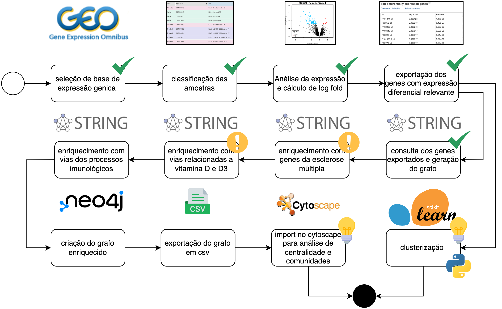
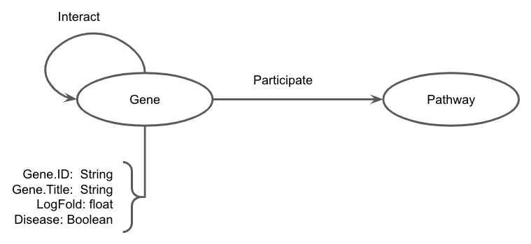

# Projeto `Expressão Gênica de Vitamina D no tratamento de Esclerose Múltipla`
# Project `Vitamin D Gene Expression in the Treatment of Multiple Sclerosis>`

# Descrição Resumida do Projeto

A esclerose múltipla (EM) é uma doença crônica, progressiva e autoimune que afeta o sistema nervoso central, caracterizada pela neurodegeneração e desmielinização, resultando no atraso ou impedimento da transmissão dos impulsos nervosos devido à destruição da bainha de mielina. Isso leva a sintomas como fraqueza nos membros inferiores, espasticidade, urgência urinária, fadiga, atrofia muscular, espasmos e alterações cognitivas. A EM é multifatorial, envolvendo fatores imunológicos, genéticos e ambientais, destacando-se a vitamina D. Indivíduos com níveis mais baixos dessa vitamina têm maior incidência de EM, com maior prevalência em países de alta latitude, menor exposição solar e consequentemente menor vitamina D. Estudos indicam que mulheres, caucasianos, adultos e residentes do norte europeu têm maior probabilidade de desenvolver a doença.

# Slides

[Apresentação Parte 2](assets/slides/P2%20-%20%20Expressão%20Gênica%20de%20Vitamina%20D%20no%20tratamento%20de%20Esclerose%20Múltipla.pdf)

# Fundamentação Teórica

A esclerose múltipla (EM) é uma doença crônica, progressiva e autoimune que afeta o sistema nervoso central. Caracterizada pela neurodegeneração e desmielinização, resultando no atraso ou impedimento da transmissão dos impulsos nervosos provocado pela destruição da bainha de mielina, que é uma camada de tecido adiposo que envolve o axônio do neurônio e é essencial para a rápida condução dos impulsos [1]. Entre os sintomas apresentados neste acometimento estão: fraqueza no membro inferior, espasticidade, urgência urinária, fadiga, atrofia muscular, espasmo e alterações cognitivas. [2]. 
Essa doença é multifatorial, ou seja, envolve fatores imunológicos, genéticos e ambientais, entre os quais se destaca a vitamina D. Estudos mostram que indivíduos com níveis mais baixos de vitamina D têm uma maior incidência de EM [3]. Dessa maneira, epidemiologicamente, países de alta latitude, com menor exposição solar e, portanto, menor quantidade de vitamina D na população, apresentam taxas mais elevadas de EM. Além disso, os estudos indicam que mulheres, caucasianos, adultos, residentes do norte europeu têm maior probabilidade de desenvolver a doença [1].
A vitamina D é um hormônio esteroide que é adquirido pela síntese na pele - obtida através dos raios UV-B que catalisa a produção de colecalciferol (vitamina D3) a partir de um precursor (7-dihidrocolesterol) - ou pela alimentação - através do salmão, frutos do mar, ovo, sardinha e atum por exemplo. Assim, a vitamina D3 é metabolizada no fígado chegando a 25-hidroxivitamina D3 (25(OH)D3), sendo a principal forma circulante e dosável da vitamina, contudo ela é inativa. A forma ativa é obtida através da hidroxilação da 25(OH)D3 no rim que gera a 1,25(OH)2D3 também conhecida como calcitriol [4].
O calcitriol é comumente associado à regulação da homeostase do cálcio, envolvido principalmente na formação óssea. Ademais, os receptores de vitamina D também estão estão presentes em diversas células do sistema imunológico como células dendríticas, monócitos, macrófagos, células NK e linfócitos T e B, estando relacionados com: diminuição das citocinas liberadas por Th1, estímulo da função de células Th2 helper, inibição da liberação de IL-17 pelas células Th17, entre outros [4].
O tratamento com suplementação da vitamina tem, como lógica, a ação dos metabólitos agindo como moduladores parácrinos imunitários, com atividade sobre as células pró-inflamatórias T e produção de citocinas que colaboraram para a patogênese da esclerose múltipla [5]. Assim, existem estudos que mostram possíveis eventos positivos no uso da vitamina D como tratamento ou profilaxia de doenças autoimunes pelo importante papel da regulação dos sistema imunológico [3]. 

# Perguntas de Pesquisa

RQ1: A administração de vitamina D altera a expressão de genes de quais genes em pacientes com esclerose múltipla em comparação com indivíduos saudáveis?

RQ2: A administração de vitamina D está correlacionada a expressão de genes relacionados a processos imunológicos em pacientes com esclerose múltipla?

# Metodologia
> Proposta de metodologia incluindo especificação de quais de Ciência de Redes que nzestão sendo usadas no projeto,
> tais como: detecção de comunidades, análise de centralidade, predição de links, ou a combinação de uma ou mais técnicas. Descreva o que perguntas pretende endereçar com a técnica escolhida.

A metodologia seguiu um pipeline no qual foi realizada a seleção de bases de expressão gênica que prosseguiu para a classificação das amostras; classificadas as amostras, foi feito o cálculo de log fold change para a análise da expressão; os genes com expressão diferencial relevantes foram consultados na base do string para geração do grafo. Mantendo o fluxo do pipeline, houve o enriquecimento das vias dos processos imunológicos, a criação do grafo enriquecido e a exportação dos deste para análise na ferramenta cystoscape. Nessa última ferramenta, foi realizada a análise de centralidade e detecção de comunidades, usando as métricas para o Betweenness, Leiden. 

A utilização da técnica teve por objetivo saber quais foram os genes mais centrais que estão envolvidos na administração da vitamina D em pacientes com escloresose múltipla, comparando com indivíduos saudáveis e quais comunidades esses genes fazem parte. 

## Bases de Dados e Evolução

Base de Dados | Resumo descritivo
----- | -----
[GSE842](https://www.ncbi.nlm.nih.gov/geo/query/acc.cgi?acc=GSE842) | Expressão Gênica da administração de Vitamina D em pacientes com Esclerose Múltipla
[GO:0033280 Processo]() | Resposta à vitamina D
[GO:0042369 Processo]() | Processo catabólico de vitamina D
[GO:0042359 Processo]() | Processo metabólico da vitamina D
[GO:0070640 Processo]() | Processo metabólico da vitamina D3
[GO:0070643 Função]() | Atividade da vitamina D 25-hidroxilase
[GO:0030343 Função]() | Atividade da vitamina D3 25-hidroxilase
[PMID:32528735]() | Esclerose Múltipla: Lipídios, Linfócitos e Vitamina D.

> Faça uma descrição sobre o que concluiu sobre esta base. Sugere-se que respondam perguntas ou forneçam informações indicadas a seguir:
> * O que descobriu sobre essa base?
> * Quais as transformações e tratamentos (e.g., dados faltantes e limpeza) feitos?

## Modelo Lógico

## Integração entre Bases

> Descreva se houve desafios de integração de fontes de dados.

## Análise Preliminar

  
Foram encontrados esses genes como os mais centrais na análise das redes: Actb, Ctss, Cxcl10, Fn1, Ifitm3. O actb é um gene que codifica actina envolvida na motilidade, estrutura e comunicação intercelular, além de estar envolida na regulação da dinâmica da actina para a formação de copo fagocitário, importante para as células fagocitárias do sistema imune como macrófagos e células dendríticas [8]. O gene Ctss codifica uma proteína que está envolvida na apresentação de MCH de classe II, relacionada diretamente na patologia de muitas doenças inflamatórias e autoimunes [9]. O gene Cxcl10 codifica uma quimiocina relacionada com a estimulação de monócitos, natural killer,  migração de células T e modulação da expressão de moléculas de adesão [10]. O gene Fn1 codifica a fibronectina que está envolvida na adesão celular, migração celular, sistema imunológico, mineralização dos osteoblastos e inibe a ativação de monócitos [11]. O gene Ifitm3 está relacionado com a sinalização de citocinas do sistema imunológico, mais especificamente os interferons [12]. Dessa maneira, percebe-se que todos os genes evidenciados estão diretamente relacionadas a processos inflamatórios desenvolvidos através do sistema imunológico e por isso estão relacionados aos receptores de vitamina D presentes na células imunes e à esclerose múltipla.

## Evolução do Projeto
> Este item não é obrigatório neste estágio, mas pode ser uma preparação para o estágio final.
> Relatório de evolução, descrevendo as evoluções na modelagem do projeto, dificuldades enfrentadas, mudanças de rumo, melhorias e lições aprendidas. Referências aos diagramas, modelos e recortes de mudanças são bem-vindos.
> Podem ser apresentados destaques na evolução dos modelos conceitual e lógico. O modelo inicial e intermediários (quando relevantes) e explicação de refinamentos, mudanças ou evolução do projeto que fundamentaram as decisões.
> Relatar o processo para se alcançar os resultados é tão importante quanto os resultados.

# Ferramentas

### [Neo4j](https://neo4j.com/)

- **Armazenamento de Dados de Expressão Gênica**: Perfis de expressão gênica.
- **Armazenamento de vias**: Conjunto de interações entre genes e vias.

### [Cytoscape](https://cytoscape.org/)
- **Identificação de Hubs Genéticos**: Nós mais conectados na rede.
- **Centralidade e Expressão Gênica**: Importância dos nós com base em medidas de centralidade e expressão gênica.

# Referências Bibliográficas

1. **NOGUEIRA, Raquel Araujo et al**. The vitamin D and immunological performance: a perspective within multiple sclerosis. 2021. Disponível em: [https://rsdjournal.org/index.php/rsd/article/view/22575/20285](https://rsdjournal.org/index.php/rsd/article/view/22575/20285) Acesso em: 21 mai. 2024.

2. **MATIAS, Francisco Gil Gonçalves**. Vitamina D e esclerose múltipla. 2009. Dissertação de Mestrado. Disponível em: [https://estudogeral.uc.pt/handle/10316/27526?locale=pt](https://estudogeral.uc.pt/handle/10316/27526?locale=pt) Acesso em: 21 mai. 2024.

3. **PEREIRA, Ana Rita Rodrigues**. Relatório de Estágio e Monografia intitulada “Mecanismos Moduladores da Vitamina D na Esclerose Múltipla. 2020. Dissertação de Mestrado. Disponível em: [https://estudogeral.uc.pt/handle/10316/92941](https://estudogeral.uc.pt/handle/10316/92941) Acesso em: 21 mai. 2024.

4. **MARQUES, Cláudia Diniz Lopes et al**. A importância dos níveis de vitamina D nas doenças autoimunes. Revista Brasileira de Reumatologia, v. 50, p. 67-80, 2010. Disponível em: [https://www.scielo.br/j/rbr/a/5BcvSsQGhJPXXD8Q9Pzff8H/?lang=pt#](https://www.scielo.br/j/rbr/a/5BcvSsQGhJPXXD8Q9Pzff8H/?lang=pt#) Acesso em: 21 mai. 2024.

5. **PEREIRA, Isabel Teresa Pereira Barros da Cunha**. Importância da Vitamina D na esclerose múltipla: Monografia: The role of Vitamin D in multiple sclerosis. 2009. Disponível em: [https://repositorio-aberto.up.pt/handle/10216/54674](https://repositorio-aberto.up.pt/handle/10216/54674) Acesso em: 21 mai. 2024.

6. Naive, EAE placebo-treated and EAE 1,25(OH)2D3-treated groups. Disponível em: [https://www.ncbi.nlm.nih.gov/geo/query/acc.cgi?acc=GSE842](https://www.ncbi.nlm.nih.gov/geo/query/acc.cgi?acc=GSE842)

7. **Karen M. Spach et al.** Gene expression analysis suggests that 1,25-dihydroxyvitamin D3 reverses experimental autoimmune encephalomyelitis by stimulating inflammatory cell apoptosis, 2004. Disponível em: [https://journals.physiology.org/doi/full/10.1152/physiolgenomics.00003.2004](https://journals.physiology.org/doi/full/10.1152/physiolgenomics.00003.2004) Acesso em: 21 mai. 2024.

8. **ACTB Gene** - Actin Beta. Disponível em: [https://www.genecards.org/cgi-bin/carddisp.pl?gene=ACTB](https://www.genecards.org/cgi-bin/carddisp.pl?gene=ACTB) Acesso em: 21 mai. 2024.

9. **CTSS Gene** - Cathepsin S. Disponível em: [https://www.genecards.org/cgi-bin/carddisp.pl?gene=CTSS](https://www.genecards.org/cgi-bin/carddisp.pl?gene=CTSS) Acesso em: 21 mai. 2024.

10. **CXCL10 Gene** - C-X-C Motif Chemokine Ligand 10. Disponível em: [https://www.genecards.org/cgi-bin/carddisp.pl?gene=CXCL10](https://www.genecards.org/cgi-bin/carddisp.pl?gene=CXCL10) Acesso em: 21 mai. 2024.

11. **FN1 Gene** - Fibronectin 1. Disponível em: [https://www.genecards.org/cgi-bin/carddisp.pl?gene=FN1](https://www.genecards.org/cgi-bin/carddisp.pl?gene=FN1) Acesso em: 21 mai. 2024.

12. **IFITM3 Gene** - Interferon Induced Transmembrane Protein 3. Disponível em: [https://www.genecards.org/cgi-bin/carddisp.pl?gene=IFITM3](https://www.genecards.org/cgi-bin/carddisp.pl?gene=IFITM3) Acesso em: 21 mai. 2024.
